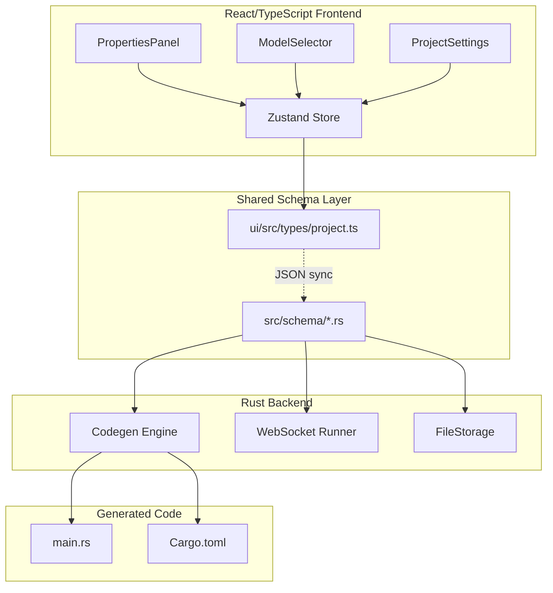
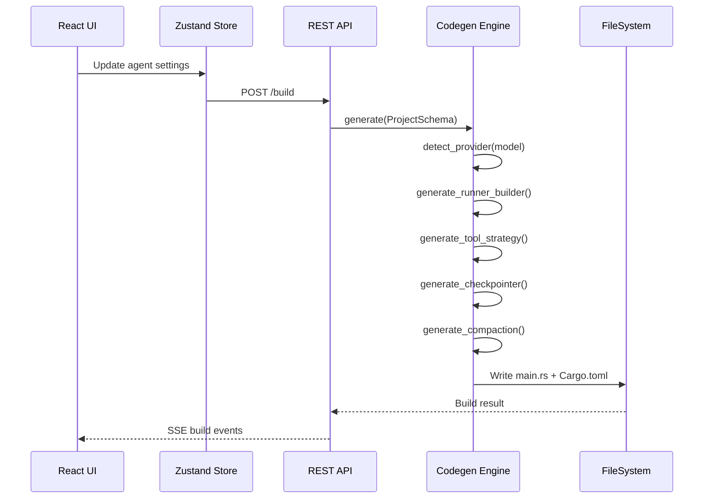
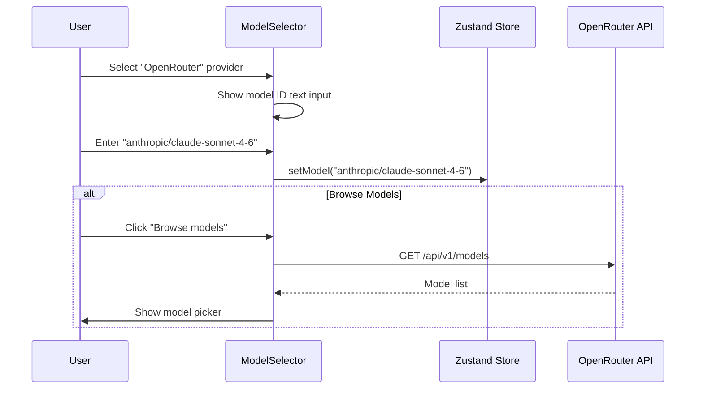

# Design Document: ADK 0.8.0 Feature Parity

## Overview

ADK Studio v0.8.0 currently generates functional Rust code using ADK-Rust core APIs but misses several capabilities introduced in ADK-Rust 0.6–0.8. This feature brings full parity across five work streams: (1) generated code quality improvements (typestate builder, auto tool execution, checkpointing, compaction), (2) agent properties panel extensions (timeouts, retries, circuit breakers, tool confirmation), (3) model-specific configuration (extended thinking, reasoning effort, prompt caching), (4) OpenRouter integration as a new provider, and (5) router agent upgrade to `LlmConditionalAgent` plus project-level skills support.

All changes maintain backward compatibility with existing projects. The schema additions use `Option<T>` with `#[serde(default)]` so existing JSON files deserialize without modification. Generated code targets `adk-rust 0.8.0` crates published on crates.io.

The implementation spans both the Rust backend (schema types in `src/schema/`, code generation in `src/codegen/mod.rs`, runtime in `src/server/websocket.rs`) and the React/TypeScript frontend (types in `ui/src/types/`, components in `ui/src/components/Panels/`, state in `ui/src/store/slices/`, model data in `ui/src/data/models.ts`).

## Architecture



## Sequence Diagrams

### Work Stream 1: Code Generation Flow



### Work Stream 4: OpenRouter Model Selection



## Components and Interfaces

### Component 1: Extended AgentSchema (Rust)

**Purpose**: Store all new agent-level configuration fields.

**Interface**:
```rust
/// Agent definition schema — extended for ADK 0.8.0 parity
#[derive(Debug, Clone, Serialize, Deserialize)]
pub struct AgentSchema {
    // ... existing fields ...

    // === Work Stream 2: Agent Properties Extensions ===
    /// Tool timeout in seconds (default: 300)
    #[serde(default, skip_serializing_if = "Option::is_none")]
    pub tool_timeout_secs: Option<u32>,

    /// Max LLM iterations before stopping (default: 100)
    #[serde(default, skip_serializing_if = "Option::is_none")]
    pub max_llm_iterations: Option<u32>,

    /// Per-tool retry budget (1-5 retries)
    #[serde(default, skip_serializing_if = "Option::is_none")]
    pub tool_retry_budget: Option<u8>,

    /// Circuit breaker threshold (consecutive failures before tripping)
    #[serde(default, skip_serializing_if = "Option::is_none")]
    pub circuit_breaker_threshold: Option<u8>,

    /// Tools requiring human confirmation before execution
    #[serde(default, skip_serializing_if = "Vec::is_empty")]
    pub tools_requiring_confirmation: Vec<String>,

    /// Tool execution strategy: "sequential", "parallel", "auto"
    #[serde(default, skip_serializing_if = "Option::is_none")]
    pub tool_execution_strategy: Option<String>,

    // === Work Stream 3: Model-Specific Configuration ===
    /// Anthropic extended thinking toggle
    #[serde(default, skip_serializing_if = "Option::is_none")]
    pub extended_thinking: Option<bool>,

    /// Anthropic extended thinking token budget (1024-32768)
    #[serde(default, skip_serializing_if = "Option::is_none")]
    pub thinking_budget_tokens: Option<u32>,

    /// OpenAI o-series reasoning effort: "low", "medium", "high"
    #[serde(default, skip_serializing_if = "Option::is_none")]
    pub reasoning_effort: Option<String>,

    /// Anthropic prompt caching toggle
    #[serde(default, skip_serializing_if = "Option::is_none")]
    pub prompt_caching: Option<bool>,

    // === Work Stream 5: Skills ===
    /// Enable auto-skills loading
    #[serde(default, skip_serializing_if = "Option::is_none")]
    pub auto_skills: Option<bool>,
}
```

**Responsibilities**:
- Serialize/deserialize all agent configuration to/from JSON
- Provide defaults via `Option<T>` + `#[serde(default)]` for backward compatibility
- Feed into codegen engine for Rust code generation

### Component 2: Extended ProjectSettings (Rust)

**Purpose**: Store project-level settings for checkpointing, skills path, and OpenRouter.

**Interface**:
```rust
#[derive(Debug, Clone, Serialize, Deserialize)]
#[serde(rename_all = "camelCase")]
pub struct ProjectSettings {
    // ... existing fields ...

    // === Work Stream 1: Checkpointing ===
    /// Enable SQLite checkpointing in generated graph code
    #[serde(default)]
    pub sqlite_checkpointer: Option<bool>,

    /// Enable context compaction in generated runner
    #[serde(default)]
    pub context_compaction: Option<bool>,

    // === Work Stream 5: Skills ===
    /// Project-level skills directory path
    #[serde(default)]
    pub skills_directory: Option<String>,
}
```

### Component 3: TypeScript AgentSchema Extension

**Purpose**: Mirror Rust schema in the frontend for UI binding.

**Interface**:
```typescript
export interface AgentSchema {
  // ... existing fields ...

  // Work Stream 2: Agent Properties Extensions
  tool_timeout_secs?: number;
  max_llm_iterations?: number;
  tool_retry_budget?: number;
  circuit_breaker_threshold?: number;
  tools_requiring_confirmation?: string[];
  tool_execution_strategy?: 'sequential' | 'parallel' | 'auto';

  // Work Stream 3: Model-Specific Configuration
  extended_thinking?: boolean;
  thinking_budget_tokens?: number;
  reasoning_effort?: 'low' | 'medium' | 'high';
  prompt_caching?: boolean;

  // Work Stream 5: Skills
  auto_skills?: boolean;
}

export interface ProjectSettings {
  // ... existing fields ...
  sqliteCheckpointer?: boolean;
  contextCompaction?: boolean;
  skillsDirectory?: string;
}
```

### Component 4: OpenRouter Provider (TypeScript)

**Purpose**: Add OpenRouter as a provider with custom model ID input.

**Interface**:
```typescript
// Addition to PROVIDERS array in ui/src/data/models.ts
export const OPENROUTER_PROVIDER: ProviderInfo = {
  id: 'openrouter',
  name: 'OpenRouter',
  icon: '🌐',
  envVar: 'OPENROUTER_API_KEY',
  docsUrl: 'https://openrouter.ai/docs',
  models: [], // Dynamic — user enters model ID
};

// New interface for custom model input
export interface CustomModelInput {
  providerId: string;
  modelId: string;
  isCustom: boolean;
}
```

### Component 5: ModelSelector Extensions

**Purpose**: Show model-specific configuration conditionally based on selected provider/model.

**Responsibilities**:
- Show "Extended thinking" toggle + budget slider when Anthropic model selected
- Show "Reasoning effort" dropdown when OpenAI o-series model selected
- Show "Prompt caching" toggle when Anthropic model selected
- Show free-text model ID input when OpenRouter selected
- Show optional "Browse models" button for OpenRouter

### Component 6: Codegen Engine Extensions

**Purpose**: Generate improved Rust code leveraging ADK 0.8.0 APIs.

**Responsibilities**:
- Emit `Runner::builder()` typestate pattern instead of `Runner::new(RunnerConfig { ... })`
- Default to `ToolExecutionStrategy::Auto` for all agents
- Conditionally emit `SqliteCheckpointer` setup when project setting enabled
- Conditionally emit compaction config when agent setting enabled
- Mark `GoogleSearchTool` and `LoadArtifactsTool` as `.read_only(true)` in generated code
- Emit `OpenRouterClient`/`OpenRouterConfig` for OpenRouter models
- Add `features = ["openrouter"]` to generated Cargo.toml when OpenRouter used
- Replace router codegen with `LlmConditionalAgent` builder
- Emit `with_auto_skills()` or `with_skills_from_root(path)` when skills enabled

## Data Models

### Model 1: ToolExecutionStrategy (Codegen Output)

```rust
// Generated in main.rs — not a schema type
// Enum from adk-runner 0.8.0
enum ToolExecutionStrategy {
    Sequential,
    Parallel,
    Auto, // Default: read-only tools run concurrently
}
```

**Validation Rules**:
- Must be one of: "sequential", "parallel", "auto"
- Default is "auto" when not specified

### Model 2: OpenRouter Detection

```typescript
// In detectProviderFromModel()
function isOpenRouterModel(modelId: string): boolean {
  return modelId.includes('/') && 
    !modelId.includes('accounts/fireworks/') &&
    !modelId.startsWith('meta-llama/') &&
    !modelId.startsWith('Meta-Llama/') &&
    !modelId.startsWith('Qwen/');
}
```

**Validation Rules**:
- Model ID contains "/" separator (e.g., "anthropic/claude-sonnet-4-6")
- Excludes known provider-specific slash patterns (Fireworks, Together, Groq)

## Key Functions with Formal Specifications

### Function 1: generate_runner_builder()

```rust
fn generate_runner_builder(project: &ProjectSchema, agent_var: &str) -> String
```

**Preconditions:**
- `project` is a valid, non-empty ProjectSchema
- `agent_var` is a valid Rust identifier string referencing the root agent variable

**Postconditions:**
- Returns syntactically valid Rust code using `Runner::builder()` typestate pattern
- If `project.settings.sqlite_checkpointer == Some(true)`, output includes `SqliteCheckpointer::new()` setup
- If `project.settings.context_compaction == Some(true)`, output includes `.compaction_config(...)` call
- Generated code compiles against adk-runner 0.8.0

**Loop Invariants:** N/A

### Function 2: generate_tool_execution_strategy()

```rust
fn generate_tool_execution_strategy(agent: &AgentSchema) -> String
```

**Preconditions:**
- `agent` is a valid AgentSchema

**Postconditions:**
- If `agent.tool_execution_strategy` is None or Some("auto"), returns code for `ToolExecutionStrategy::Auto`
- If Some("sequential"), returns `ToolExecutionStrategy::Sequential`
- If Some("parallel"), returns `ToolExecutionStrategy::Parallel`
- Generated code marks GoogleSearchTool and LoadArtifactsTool as read-only regardless of strategy

### Function 3: generate_openrouter_model()

```rust
fn generate_openrouter_model(model_id: &str) -> String
```

**Preconditions:**
- `model_id` contains "/" (OpenRouter format)
- `model_id` is non-empty

**Postconditions:**
- Returns Rust code constructing `OpenRouterClient::new(OpenRouterConfig::new(&api_key, "{model_id}"))`
- Generated code references `OPENROUTER_API_KEY` environment variable

### Function 4: generate_router_agent() (upgraded)

```rust
fn generate_router_agent(id: &str, agent: &AgentSchema, project: &ProjectSchema) -> String
```

**Preconditions:**
- `agent.agent_type == AgentType::Router`
- `agent.routes` is non-empty

**Postconditions:**
- Returns Rust code using `LlmConditionalAgent::builder()` instead of manual routing logic
- Each route condition maps to a `.condition(condition, target_agent)` call
- Generated code compiles against adk-agent 0.8.0

### Function 5: generate_skills_config()

```rust
fn generate_skills_config(agent: &AgentSchema, project: &ProjectSchema) -> String
```

**Preconditions:**
- `agent.auto_skills == Some(true)` OR `project.settings.skills_directory.is_some()`

**Postconditions:**
- If skills_directory is set, returns `.with_skills_from_root("{path}")` call
- If only auto_skills is true, returns `.with_auto_skills()` call
- Returns empty string if neither condition met

## Algorithmic Pseudocode

### Main Code Generation Algorithm (Updated)

```rust
fn generate_main_rs(project: &ProjectSchema) -> String {
    let mut code = String::new();
    
    // 1. Generate imports (add OpenRouter if needed)
    let providers = collect_providers(project);
    generate_imports(&mut code, &providers);
    
    // 2. Generate tool functions (unchanged)
    generate_custom_tools(&mut code, project);
    
    // 3. Generate main function
    code.push_str("#[tokio::main]\nasync fn main() -> Result<()> {\n");
    
    // 4. API key resolution (add OpenRouter)
    generate_api_key_resolution(&mut code, &providers);
    
    // 5. Build agents with new properties
    for (id, agent) in &project.agents {
        match agent.agent_type {
            AgentType::Router => {
                // NEW: Use LlmConditionalAgent instead of manual routing
                code.push_str(&generate_router_agent(id, agent, project));
            }
            AgentType::Llm => {
                code.push_str(&generate_llm_agent(id, agent, project));
                // NEW: Apply tool execution strategy
                code.push_str(&generate_tool_execution_strategy(agent));
                // NEW: Apply tool timeout, retry, circuit breaker
                code.push_str(&generate_resilience_config(agent));
                // NEW: Apply model-specific config
                code.push_str(&generate_model_config(agent));
                // NEW: Apply skills
                code.push_str(&generate_skills_config(agent, project));
            }
            _ => { /* existing logic */ }
        }
    }
    
    // 6. Build graph (unchanged)
    generate_graph_construction(&mut code, project);
    
    // 7. NEW: Build runner with typestate builder
    code.push_str(&generate_runner_builder(project, "root_agent"));
    
    // 8. Run loop (unchanged)
    generate_run_loop(&mut code);
    
    code.push_str("}\n");
    code
}
```

### Provider Detection Algorithm (Updated)

```rust
fn detect_provider(model: &str) -> &'static str {
    let m = model.to_lowercase();
    
    // NEW: OpenRouter detection — model contains "/" but isn't a known provider path
    if model.contains('/') 
        && !m.contains("accounts/fireworks/")
        && !m.starts_with("meta-llama/")
        && !m.starts_with("qwen/")
        && !m.contains("-turbo")  // Together uses Turbo suffix
    {
        return "openrouter";
    }
    
    // ... existing detection logic unchanged ...
}
```

### Cargo.toml Generation (Updated)

```rust
fn generate_cargo_toml(project: &ProjectSchema) -> String {
    let providers = collect_providers(project);
    let mut features = vec!["gemini"]; // always included
    
    // NEW: Add openrouter feature flag
    if providers.contains("openrouter") {
        features.push("openrouter");
    }
    
    // NEW: Add sqlite feature for checkpointer
    let uses_sqlite = project.settings.sqlite_checkpointer == Some(true);
    
    format!(
        r#"[dependencies]
adk-model = {{ version = "0.8.0", features = {features:?} }}
adk-runner = "0.8.0"
{sqlite_dep}
"#,
        features = features,
        sqlite_dep = if uses_sqlite { 
            "adk-checkpointer-sqlite = \"0.8.0\"\n" 
        } else { "" }
    )
}
```

## Example Usage

### Generated Runner Code (Before → After)

**Before (current):**
```rust
let runner = Runner::new(RunnerConfig {
    app_name: "my-agent".into(),
    agent: root_agent,
    session_service: svc,
    artifact_service: None,
    memory_service: None,
    plugin_manager: None,
    run_config: None,
    compaction_config: None,
    context_cache_config: None,
    cache_capable: None,
    request_context: None,
    cancellation_token: None,
})?;
```

**After (new typestate builder):**
```rust
let runner = Runner::builder("my-agent", root_agent, svc)
    .tool_execution_strategy(ToolExecutionStrategy::Auto)
    .checkpointer(SqliteCheckpointer::new("./checkpoints.db").await?)
    .compaction_config(CompactionConfig::default())
    .build()?;
```

### Generated Agent Code with New Properties

```rust
let mut agent_builder = LlmAgentBuilder::new("researcher")
    .model(Arc::new(AnthropicClient::new(
        AnthropicConfig::new(&anthropic_api_key, "claude-sonnet-4-6")
            .with_extended_thinking(true)
            .with_thinking_budget(16384)
            .with_prompt_caching(true)
    )?))
    .instruction("You are a research assistant...")
    .tool_timeout(Duration::from_secs(300))
    .max_iterations(100)
    .tool_retry_budget(3)
    .tool_execution_strategy(ToolExecutionStrategy::Auto)
    .with_auto_skills();

// Tools with read-only marking
agent_builder = agent_builder
    .tool(GoogleSearchTool::new().read_only(true))
    .tool(LoadArtifactsTool::new().read_only(true))
    .tool(custom_tool.with_confirmation(true));

let researcher = agent_builder.build()?;
```

### Generated OpenRouter Agent

```rust
let openrouter_api_key = std::env::var("OPENROUTER_API_KEY")
    .expect("OPENROUTER_API_KEY must be set");

let agent = LlmAgentBuilder::new("assistant")
    .model(Arc::new(OpenRouterClient::new(
        OpenRouterConfig::new(&openrouter_api_key, "anthropic/claude-sonnet-4-6")
    )?))
    .instruction("You are a helpful assistant")
    .build()?;
```

### Generated Router Agent (Upgraded)

```rust
// Before: Manual routing with match statements
// After: LlmConditionalAgent
let router = LlmConditionalAgent::builder("task_router")
    .model(Arc::new(GeminiModel::new(&gemini_api_key, "gemini-2.5-flash")?))
    .instruction("Route tasks to the appropriate specialist agent")
    .condition("coding tasks", coding_agent)
    .condition("research tasks", research_agent)
    .condition("writing tasks", writing_agent)
    .build()?;
```

## Correctness Properties

*A property is a characteristic or behavior that should hold true across all valid executions of a system — essentially, a formal statement about what the system should do. Properties serve as the bridge between human-readable specifications and machine-verifiable correctness guarantees.*

### Property 1: Runner Builder Pattern Generation

*For any* valid ProjectSchema, the generated runner initialization code SHALL use the `Runner::builder()` typestate pattern (containing "Runner::builder(") and SHALL NOT contain `Runner::new(RunnerConfig`. When `sqlite_checkpointer` is enabled, the output SHALL contain checkpointer setup. When `context_compaction` is enabled, the output SHALL contain compaction config. The builder chain SHALL always terminate with `.build()?`.

**Validates: Requirements 1.1, 1.2, 1.3, 1.4**

### Property 2: Tool Execution Strategy Codegen

*For any* AgentSchema with a `tool_execution_strategy` value, the generated code SHALL contain exactly the corresponding `ToolExecutionStrategy::` variant: None/"auto" → Auto, "sequential" → Sequential, "parallel" → Parallel. For any string value not in {"auto", "sequential", "parallel"}, the generated code SHALL contain `ToolExecutionStrategy::Auto` and a warning comment.

**Validates: Requirements 2.1, 2.2, 2.3, 2.4**

### Property 3: Read-Only Tool Marking

*For any* ProjectSchema whose agents use `GoogleSearchTool` or `LoadArtifactsTool`, the generated code SHALL contain `.read_only(true)` associated with each such tool, regardless of the configured `tool_execution_strategy`.

**Validates: Requirements 3.1, 3.2, 3.3**

### Property 4: Resilience Configuration Codegen

*For any* AgentSchema with resilience fields set (`tool_timeout_secs`, `max_llm_iterations`, `tool_retry_budget`, `circuit_breaker_threshold`), the generated code SHALL contain the corresponding builder method call with the exact configured value. *For any* AgentSchema where all resilience fields are None, the generated code SHALL NOT contain any of these builder method calls.

**Validates: Requirements 4.2, 4.3, 4.4, 4.5, 4.6**

### Property 5: Tool Confirmation Codegen

*For any* AgentSchema, tools listed in `tools_requiring_confirmation` SHALL have `.with_confirmation(true)` in the generated code, and tools NOT in that list SHALL NOT have confirmation markup.

**Validates: Requirements 5.3, 5.4**

### Property 6: Model-Specific Configuration Codegen

*For any* AgentSchema with an Anthropic model and `extended_thinking=true`, the generated code SHALL contain `.with_extended_thinking(true)` and `.with_thinking_budget({value})`. *For any* AgentSchema with an Anthropic model and `prompt_caching=true`, the generated code SHALL contain `.with_prompt_caching(true)`. *For any* AgentSchema with a non-Anthropic model, the generated code SHALL NOT contain any Anthropic-specific config calls regardless of stored field values.

**Validates: Requirements 7.2, 7.3, 7.4, 8.2, 8.3**

### Property 7: Reasoning Effort Codegen

*For any* AgentSchema with an OpenAI o-series model and `reasoning_effort` set, the generated code SHALL contain `.with_reasoning_effort(ReasoningEffort::{Value})`. *For any* AgentSchema with a non-OpenAI model, the generated code SHALL NOT contain reasoning effort configuration regardless of stored field values.

**Validates: Requirements 9.2, 9.4**

### Property 8: OpenRouter Code Generation

*For any* model ID classified as OpenRouter by Provider_Detection, the generated code SHALL contain `OpenRouterClient::new(OpenRouterConfig::new(` with the correct model ID, and the generated Cargo.toml SHALL contain `features = ["openrouter"]` in the adk-model dependency.

**Validates: Requirements 10.5, 10.6, 15.1**

### Property 9: Provider Detection Correctness

*For any* model ID string containing "/" that does NOT match known provider patterns (accounts/fireworks/, meta-llama/, Meta-Llama/, Qwen/), `detect_provider()` SHALL return "openrouter". *For any* model ID matching a known provider's slash pattern, `detect_provider()` SHALL return that provider's ID instead. The Rust and TypeScript implementations SHALL produce identical results for the same input.

**Validates: Requirements 11.1, 11.2, 11.3**

### Property 10: Router Agent LlmConditionalAgent Generation

*For any* router AgentSchema with N routes, the generated code SHALL contain `LlmConditionalAgent::builder()`, exactly N `.condition()` calls (one per route with correct condition and target), and the router's model and instruction configuration.

**Validates: Requirements 12.1, 12.2, 12.3**

### Property 11: Skills Configuration Codegen

*For any* AgentSchema with `auto_skills=true`, the generated code SHALL contain `.with_auto_skills()`. *For any* ProjectSchema with `skills_directory` set, agent builders SHALL contain `.with_skills_from_root("{path}")`. *For any* `skills_directory` value starting with "/" or containing "..", the Codegen_Engine SHALL reject or sanitize the path.

**Validates: Requirements 13.1, 13.2, 13.4**

### Property 12: Schema Backward Compatibility Round-Trip

*For any* valid ProjectSchema JSON saved without the new fields (old format), deserialization with the extended schema SHALL succeed with all new fields set to None/empty defaults. *For any* valid ProjectSchema with new fields populated, serializing then deserializing SHALL produce an equivalent schema (round-trip preservation).

**Validates: Requirements 14.1, 14.4**

### Property 13: Generated Cargo.toml Correctness

*For any* valid ProjectSchema, the generated Cargo.toml SHALL: (a) include `adk-checkpointer-sqlite` only when `sqlite_checkpointer` is enabled, (b) include only feature flags for providers actually used in the project, (c) target version "0.8.0" for all adk crate dependencies.

**Validates: Requirements 15.2, 15.3, 15.4**

## Error Handling

### Error Scenario 1: Invalid Tool Execution Strategy

**Condition**: User somehow sets `tool_execution_strategy` to an invalid string value
**Response**: Codegen falls back to `ToolExecutionStrategy::Auto` and emits a warning comment in generated code
**Recovery**: UI dropdown prevents invalid values; schema validation catches on deserialization

### Error Scenario 2: OpenRouter Model ID Without API Key

**Condition**: User selects OpenRouter provider but `OPENROUTER_API_KEY` is not set at build time
**Response**: Existing env var warning system (`check_env_vars()`) flags the missing key
**Recovery**: Build modal shows warning; generated code panics with descriptive message at runtime

### Error Scenario 3: Extended Thinking on Non-Anthropic Model

**Condition**: User enables extended_thinking but switches to a non-Anthropic model
**Response**: Codegen ignores `extended_thinking` and `thinking_budget_tokens` for non-Anthropic providers
**Recovery**: UI hides the toggle when provider changes; schema retains value for if user switches back

### Error Scenario 4: SQLite Checkpointer Path Conflict

**Condition**: Multiple agents in same project with checkpointer enabled
**Response**: Single shared checkpointer instance at project level (not per-agent)
**Recovery**: Generated code creates one `SqliteCheckpointer` in main() and passes Arc to runner

### Error Scenario 5: Skills Directory Not Found

**Condition**: Configured skills_directory path doesn't exist at runtime
**Response**: Generated code uses `with_skills_from_root()` which returns error at agent build time
**Recovery**: Runtime error message indicates path not found; user fixes path in project settings

## Testing Strategy

### Unit Testing Approach

- **Schema deserialization**: Test that existing project JSON files (without new fields) deserialize correctly with defaults
- **Provider detection**: Test `detect_provider()` with OpenRouter-style model IDs, ensuring no false positives with existing providers
- **Codegen output**: Snapshot tests comparing generated code for projects with various combinations of new settings
- **Cargo.toml generation**: Verify correct feature flags based on provider usage

### Property-Based Testing Approach

**Property Test Library**: proptest (already in dev-dependencies)

- **Backward compat property**: For any randomly generated ProjectSchema (old format), adding new Option fields and re-serializing produces valid JSON that round-trips
- **Provider detection property**: For any model_id containing "/" that doesn't match known provider prefixes, `detect_provider()` returns "openrouter"
- **Strategy codegen property**: For any valid `tool_execution_strategy` value, generated code contains exactly one `ToolExecutionStrategy::` variant

### Integration Testing Approach

- **End-to-end codegen**: Generate code for a project using all 5 work streams, compile it against adk-rust 0.8.0 (requires adk crates available)
- **UI component tests**: Verify conditional rendering of model-specific fields based on provider selection
- **WebSocket runner**: Test that `Runner::builder()` pattern works in the live preview runner

## Performance Considerations

- **OpenRouter model browsing**: The "Browse models" feature fetches from OpenRouter's API. Cache results for 5 minutes to avoid repeated network calls during a session.
- **Codegen speed**: New code paths add minimal overhead (string concatenation). The existing 4700+ line codegen module already handles complex logic; additions are O(1) per agent.
- **SQLite checkpointer**: When enabled, adds disk I/O to each graph execution step. Document this tradeoff in the project settings tooltip.
- **Tool execution strategy Auto**: Concurrent read-only tool execution improves latency for agents with multiple search/retrieval tools. No performance regression for sequential-only workflows.

## Security Considerations

- **API key handling**: OpenRouter API key follows the same pattern as existing providers — stored in `.env`, never committed, referenced via `std::env::var()` in generated code.
- **Tool confirmation**: The `tools_requiring_confirmation` field enables human-in-the-loop for sensitive tools. Generated code emits a confirmation callback that blocks execution until approved.
- **Skills directory**: The `skills_directory` path is user-configured and used in generated code. Validate it's a relative path within the project to prevent path traversal.

## Dependencies

### Rust Crates (Generated Code)

| Crate | Version | Purpose |
|-------|---------|---------|
| adk-runner | 0.8.0 | Runner::builder() typestate, ToolExecutionStrategy |
| adk-agent | 0.8.0 | LlmAgentBuilder, LlmConditionalAgent |
| adk-model | 0.8.0 | OpenRouterClient (feature-gated) |
| adk-checkpointer-sqlite | 0.8.0 | SqliteCheckpointer (optional) |
| adk-tool | 0.8.0 | read_only() trait method |

### Frontend (Existing)

| Package | Purpose |
|---------|---------|
| zustand | State management for new settings |
| react | UI components for properties panel |
| reactflow | Canvas (unchanged) |

### No New Dependencies Required

All changes use existing packages. The OpenRouter "Browse models" feature uses the existing `fetch` API (no new HTTP client needed in the frontend).

---

## UI Mockups

### Mockup 1: Agent Properties Panel — Resilience Section

When an LLM agent node is selected, the right panel shows a new collapsible "Resilience & Execution" section below the existing instruction/tools sections:

```
┌─────────────────────────────────────┐
│ 🤖 researcher                    ✕  │
├─────────────────────────────────────┤
│ Model: [gemini-3.1-flash-lite ▼]    │
│ Instruction: [..................]    │
│ Tools: google_search, custom_fn     │
├─────────────────────────────────────┤
│ ▼ Resilience & Execution            │
│                                     │
│ Tool Execution Strategy             │
│ [Auto (concurrent read-only)    ▼]  │
│                                     │
│ Tool Timeout                        │
│ [300] seconds                       │
│                                     │
│ Max LLM Iterations                  │
│ [100]                               │
│                                     │
│ Retry Failed Tools                  │
│ [✓] Enabled   Max retries: [3]     │
│                                     │
│ Circuit Breaker                     │
│ [ ] Enabled   Threshold: [5]       │
│                                     │
│ ▼ Tool Confirmation                 │
│ [ ] google_search                   │
│ [✓] delete_files  ⚠️ requires      │
│ [ ] custom_fn        approval       │
└─────────────────────────────────────┘
```

### Mockup 2: Model Selector — Anthropic with Extended Thinking

When an Anthropic model is selected, model-specific options appear below the model dropdown:

```
┌─────────────────────────────────────┐
│ Provider: [🎭 Anthropic Claude  ▼]  │
│                                     │
│ Model: [Claude Sonnet 4.6       ▼]  │
│   📏 1M  👁️ 💻 🧠 🔧               │
│   Balanced intelligence and cost    │
│                                     │
│ ─── Model Options ──────────────── │
│                                     │
│ Extended Thinking                   │
│ [✓] Enable deep reasoning           │
│                                     │
│ Thinking Budget                     │
│ [━━━━━━━━━●━━━] 16,384 tokens      │
│ 1K              32K                 │
│                                     │
│ Prompt Caching                      │
│ [✓] Cache repeated prefixes         │
└─────────────────────────────────────┘
```

### Mockup 3: Model Selector — OpenAI o-Series with Reasoning Effort

When an OpenAI o-series model (o1, o3, o4-mini) is selected:

```
┌─────────────────────────────────────┐
│ Provider: [🤖 OpenAI            ▼]  │
│                                     │
│ Model: [o3                      ▼]  │
│   📏 200K  👁️ 💻 🧠 🔧             │
│   Advanced reasoning model          │
│                                     │
│ ─── Model Options ──────────────── │
│                                     │
│ Reasoning Effort                    │
│ [● Low  ○ Medium  ○ High]          │
│                                     │
│ ℹ️ Higher effort = better accuracy  │
│    but slower and more expensive    │
└─────────────────────────────────────┘
```

### Mockup 4: Model Selector — OpenRouter Provider

When OpenRouter is selected, the model dropdown is replaced with a text input:

```
┌─────────────────────────────────────┐
│ Provider: [🌐 OpenRouter        ▼]  │
│                                     │
│ Model ID:                           │
│ [anthropic/claude-sonnet-4-6    ]   │
│                                     │
│ [🔍 Browse 400+ models]            │
│                                     │
│ Requires: OPENROUTER_API_KEY        │
│                                     │
│ ─── Model Options ──────────────── │
│ (Options shown based on model ID    │
│  prefix — e.g., anthropic/ shows    │
│  thinking toggle)                   │
└─────────────────────────────────────┘
```

### Mockup 5: OpenRouter Model Browser (Modal)

When "Browse models" is clicked, a searchable modal appears:

```
┌─────────────────────────────────────────────┐
│ 🌐 OpenRouter Models                     ✕  │
├─────────────────────────────────────────────┤
│ [🔍 Search models...                     ]  │
│                                             │
│ ┌─────────────────────────────────────────┐ │
│ │ anthropic/claude-sonnet-4-6             │ │
│ │ Claude Sonnet 4.6 · 1M ctx · $3/$15    │ │
│ ├─────────────────────────────────────────┤ │
│ │ openai/gpt-5-mini                      │ │
│ │ GPT-5 Mini · 128K ctx · $0.15/$0.60    │ │
│ ├─────────────────────────────────────────┤ │
│ │ google/gemini-2.5-flash                │ │
│ │ Gemini 2.5 Flash · 1M ctx · $0.075/$0.3│ │
│ ├─────────────────────────────────────────┤ │
│ │ meta-llama/llama-3.3-70b-instruct      │ │
│ │ Llama 3.3 70B · 128K ctx · Free        │ │
│ └─────────────────────────────────────────┘ │
│                                             │
│ Showing 4 of 412 models                     │
└─────────────────────────────────────────────┘
```

### Mockup 6: Project Settings — Production Section

A new "Production" tab in the Settings modal:

```
┌─────────────────────────────────────────────┐
│ ⚙️ Project Settings                      ✕  │
├──────┬──────┬──────┬──────┬─────────────────┤
│ Gen  │  UI  │ Env  │ Prod │                 │
├──────┴──────┴──────┴──────┴─────────────────┤
│                                             │
│ Crash Recovery                              │
│ [✓] Enable SQLite checkpointing            │
│     Persists graph state after each step.   │
│     Resumes from last checkpoint on crash.  │
│                                             │
│ Context Compaction                          │
│ [ ] Enable automatic summarization         │
│     Summarizes older events to keep LLM     │
│     context bounded in long conversations.  │
│                                             │
│ Skills Directory                            │
│ [.skills/                               ]   │
│     Path to skills directory (relative to   │
│     project root). Skills are instruction   │
│     snippets injected based on relevance.   │
│                                             │
└─────────────────────────────────────────────┘
```

### Mockup 7: Agent Node on Canvas — Visual Indicators

Agent nodes on the canvas show subtle visual indicators for active features:

```
┌─────────────────────────────┐
│ 🤖 researcher               │
│ gemini-3.1-flash-lite       │
│                             │
│ 🔧 google_search            │
│ 🔧 custom_fn  🔒            │  ← 🔒 = requires confirmation
│                             │
│ ⚡ Auto  🔄 3  🛡️ 5         │  ← strategy, retries, circuit breaker
└─────────────────────────────┘
```

### Mockup 8: Router Node — Same UI, Better Output

The router node UI stays identical — the improvement is purely in generated code:

```
┌─────────────────────────────┐
│ 🔀 task_router              │
│ gemini-2.5-flash            │
│                             │
│ Routes:                     │
│  → technical → tech_agent   │
│  → billing → billing_agent  │
│  → general → general_agent  │
└─────────────────────────────┘

Generated code changes from:
  Manual match + routing logic
To:
  LlmConditionalAgent::builder()
    .condition("technical", tech_agent)
    .condition("billing", billing_agent)
    .condition("general", general_agent)
    .build()
```
