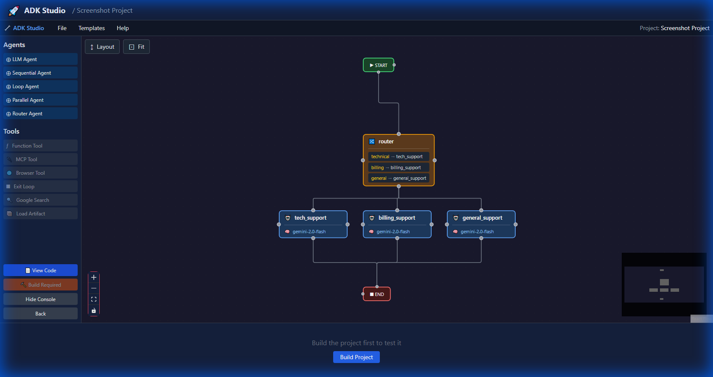

# adk-studio

Visual development environment for AI agents built with Rust Agent Development Kit (ADK-Rust).

[](https://crates.io/crates/adk-studio)
[](https://docs.rs/adk-studio)
[](LICENSE)



## Overview

`adk-studio` provides a visual, low-code development environment for building AI agents with [ADK-Rust](https://github.com/zavora-ai/adk-rust):

- **Drag-and-Drop Canvas** - Visual workflow design with ReactFlow
- **Agent Palette** - LLM Agent, Sequential, Parallel, Loop, Router agents
- **Action Nodes** - 10 non-LLM programmatic nodes for automation workflows
- **Tool Integration** - Function, MCP, Browser, Google Search tools
- **Real-Time Chat** - Test agents with live SSE streaming
- **Code Generation** - Compile visual designs to production Rust code (Gemini, OpenAI, Anthropic, DeepSeek, Groq, Ollama)
- **Build System** - Compile and run executables directly from Studio

## Installation

```bash
cargo install adk-studio
```

Or build from source:

```bash
# Keep the adk-rust repo next to this one for now:
#   ../adk-rust
# Source builds also require Node.js/npm so the embedded UI can be built.
cargo build --release -p adk-studio
```

### Source Build Notes

- `adk-studio` currently references the local sibling `../adk-rust` checkout for ADK crates.
- Source builds require `npm`; the Rust build now runs the UI build automatically.
- To skip the UI build step when `ui/dist` is already present, set `ADK_STUDIO_SKIP_UI_BUILD=1`.

## Uninstall

```bash
# Remove the binary
cargo uninstall adk-studio

# Optionally remove project data (macOS)
rm -rf ~/Library/Application\ Support/adk-studio/
# Linux
rm -rf ~/.local/share/adk-studio/
```

## Quick Start

```bash
# Start ADK Studio server
adk-studio

# Open in browser
open http://localhost:3000
```

### With Custom Host

```bash
# Bind to all interfaces (for remote access)
adk-studio --host 0.0.0.0 --port 8080
```

## Features

### Visual Agent Builder
- Drag agents from palette onto canvas
- Connect agents to create workflows (Sequential, Parallel, Loop)
- Configure agent properties: name, model, instructions, tools
- Add sub-agents to container nodes

### Action Nodes

Action nodes are non-LLM programmatic nodes for deterministic workflow operations. They complement LLM agents by handling data transformation, API integrations, control flow, and automation logic.

| Node | Icon | Description |
|------|------|-------------|
| **Trigger** | 🎯 | Workflow entry point (manual, webhook, schedule, event) |
| **HTTP** | 🌐 | Make HTTP requests to external APIs |
| **Set** | 📝 | Define and manipulate workflow state variables |
| **Transform** | ⚙️ | Transform data using expressions or built-in operations |
| **Switch** | 🔀 | Conditional branching based on conditions |
| **Loop** | 🔄 | Iterate over arrays or repeat operations |
| **Merge** | 🔗 | Combine multiple branches back into single flow |
| **Wait** | ⏱️ | Pause workflow for duration or condition |
| **Code** | 💻 | Execute authored Rust in a sandbox (primary) or JavaScript transforms via embedded boa_engine (secondary) |
| **Database** | 🗄️ | Database operations (PostgreSQL, MySQL, SQLite, MongoDB, Redis) |

#### Trigger Types

The Trigger node supports four trigger types for starting workflows:

| Type | Description | Configuration |
|------|-------------|---------------|
| **Manual** | User-initiated via UI | Input label, default prompt |
| **Webhook** | HTTP endpoint (POST/GET) | Path, method, authentication |
| **Schedule** | Cron-based timing | Cron expression, timezone, default prompt |
| **Event** | External system events | Source, event type, JSONPath filter |

##### Webhook Triggers

```bash
# Trigger via webhook (async - returns session ID)
curl -X POST "http://localhost:6000/api/projects/{id}/webhook/my-path" \
  -H "Content-Type: application/json" \
  -d '{"message": "Hello!"}'

# Trigger via webhook (sync - waits for response)
curl -X POST "http://localhost:6000/api/projects/{id}/webhook-exec/my-path" \
  -H "Content-Type: application/json" \
  -d '{"message": "Hello!"}'
```

##### Schedule Triggers

Schedule triggers use standard 5-field cron expressions:
- `* * * * *` - Every minute
- `0 9 * * *` - Daily at 9 AM
- `0 0 * * 0` - Weekly on Sunday at midnight

##### Event Triggers

Event triggers match on `source` and `eventType` with optional JSONPath filtering:

```bash
# Send an event to trigger a workflow
curl -X POST "http://localhost:6000/api/projects/{id}/events" \
  -H "Content-Type: application/json" \
  -d '{
    "source": "payment-service",
    "eventType": "payment.completed",
    "data": {
      "orderId": "12345",
      "status": "active"
    }
  }'
```

Event filter example: `$.data.status == 'active'` only triggers when status is "active".

#### Action Node Configuration

All action nodes share standard properties:

```typescript
// Standard Properties (shared by all action nodes)
{
  // Identity
  id: string;
  name: string;
  description?: string;
  
  // Error Handling
  errorHandling: {
    mode: 'stop' | 'continue' | 'retry' | 'fallback';
    retryCount?: number;      // 1-10, for retry mode
    retryDelay?: number;      // ms, for retry mode
    fallbackValue?: unknown;  // for fallback mode
  };
  
  // Tracing
  tracing: {
    enabled: boolean;
    logLevel: 'none' | 'error' | 'info' | 'debug';
  };
  
  // Execution Control
  execution: {
    timeout: number;     // ms, default 30000
    condition?: string;  // Skip if false
  };
  
  // Input/Output Mapping
  mapping: {
    inputMapping?: Record<string, string>;
    outputKey: string;
  };
}
```

#### Example: HTTP Node Configuration

```typescript
{
  type: 'http',
  name: 'Fetch User Data',
  method: 'GET',
  url: 'https://api.example.com/users/{{userId}}',
  auth: {
    type: 'bearer',
    bearer: { token: '{{API_TOKEN}}' }
  },
  headers: {
    'Accept': 'application/json'
  },
  body: { type: 'none' },
  response: {
    type: 'json',
    jsonPath: '$.data'
  },
  errorHandling: { mode: 'retry', retryCount: 3, retryDelay: 1000 },
  mapping: { outputKey: 'userData' }
}
```

#### Example: Switch Node Configuration

```typescript
{
  type: 'switch',
  name: 'Route by Status',
  evaluationMode: 'first_match',
  conditions: [
    { id: 'success', name: 'Success', field: 'status', operator: 'eq', value: 'success', outputPort: 'success' },
    { id: 'error', name: 'Error', field: 'status', operator: 'eq', value: 'error', outputPort: 'error' }
  ],
  defaultBranch: 'unknown',
  mapping: { outputKey: 'routeResult' }
}
```

#### Example: Loop Node Configuration

```typescript
{
  type: 'loop',
  name: 'Process Items',
  loopType: 'forEach',
  forEach: {
    sourceArray: 'items',
    itemVar: 'item',
    indexVar: 'idx'
  },
  parallel: {
    enabled: true,
    batchSize: 5
  },
  results: {
    collect: true,
    aggregationKey: 'processedItems'
  },
  mapping: { outputKey: 'loopResults' }
}
```

### Tool Support
- **Function Tools** - Custom functions with code editor and templates
- **MCP Tools** - Model Context Protocol servers with templates
- **Browser Tools** - Web automation with 46 WebDriver actions
- **Google Search** - Grounded search queries
- **Load Artifact** - Load binary artifacts into context

### Code Execution

Studio uses a Rust-first code execution model powered by the `adk-code` crate:

- **Primary path**: Authored Rust executed in a sandbox via `RustSandboxExecutor`. The same Rust body is used in both the live runner and generated projects.
- **Secondary scripting**: Lightweight JavaScript transforms via `EmbeddedJsExecutor` (boa_engine). Useful for data shaping and compatibility.
- **Container execution**: Python and Node.js code runs in ephemeral Docker containers via `ContainerCommandExecutor` with strict isolation defaults.
- **WASM guest modules**: Precompiled `.wasm` plugins via `WasmGuestExecutor` for portable sandboxed logic.

Sandbox settings in the UI map to controls that the selected backend can actually enforce. If a configured limit is unsupported, Studio surfaces the incompatibility before execution or export.

Browser-page JavaScript execution (via `adk-browser`) is a separate capability and is not part of the `adk-code` substrate.

### Real-Time Execution
- Live SSE streaming with agent animations
- Event trace panel for debugging
- Session memory persistence
- Thought bubble visualization

### Code Generation
- **View Code** - See generated Rust code with Monaco Editor
- **Compile** - Generate Rust project from visual design
- **Build** - Compile to executable with real-time output
- **Run** - Execute built agent directly
- **Smart Build Button** - Send button transforms to Build when workflow changes need recompilation

### Action Node Code Generation

Action nodes generate production Rust code alongside LLM agents:

| Node | Runtime | Details |
|------|---------|---------|
| **HTTP** | `reqwest` | All methods, auth (Bearer/Basic/API key), JSON/form/multipart body, JSONPath extraction |
| **Database** | `sqlx` / `mongodb` / `redis` | PostgreSQL, MySQL, SQLite via sqlx; MongoDB via native driver; Redis GET/SET/DEL/HGET/HSET/LPUSH/LRANGE |
| **Email** | `lettre` / `imap` | SMTP send with TLS + auth + To/CC/BCC; IMAP monitor with search filters + mark-as-read |
| **Code** | `adk-code` | Rust sandbox execution (primary, via `RustSandboxExecutor`); embedded JavaScript transforms (secondary, via `boa_engine`); container-backed Python/Node.js (via `ContainerCommandExecutor`) |
| **Set** | native | Variable assignment with literal, expression, and secret values |
| **Transform** | native | Map, filter, sort, reduce, flatten, group, pick, merge, template operations |
| **Merge** | native | Combine parallel branches via waitAll, waitAny, or append strategies |

All action nodes support `{{variable}}` interpolation in string fields and receive predecessor node outputs automatically. Dependencies are auto-detected and added to the generated `Cargo.toml`.

## Architecture

```
adk-studio/
├── src/
│   ├── main.rs        # CLI entry point
│   ├── server.rs      # Axum HTTP server
│   ├── routes/        # API endpoints
│   ├── codegen/       # Rust code generation
│   └── templates/     # Agent templates
└── ui/                # React frontend
    └── src/
        ├── components/
        │   ├── ActionNodes/    # Action node components
        │   ├── ActionPanels/   # Action node property panels
        │   └── ...
        └── types/
            ├── actionNodes.ts  # Action node type definitions
            └── ...
```

## API Endpoints

| Endpoint | Method | Description |
|----------|--------|-------------|
| `/api/projects` | GET/POST | List/create projects |
| `/api/projects/:id` | GET/PUT/DELETE | Project CRUD |
| `/api/projects/:id/codegen` | POST | Generate Rust code |
| `/api/projects/:id/build` | POST | Compile project |
| `/api/projects/:id/run` | POST | Run built executable |
| `/api/projects/:id/stream` | GET | SSE stream for chat |
| `/api/projects/:id/webhook/*path` | POST/GET | Webhook trigger (async) |
| `/api/projects/:id/webhook-exec/*path` | POST | Webhook trigger (sync) |
| `/api/projects/:id/webhook-events` | GET | SSE stream for webhook notifications |
| `/api/projects/:id/events` | POST | Event trigger |
| `/api/sessions/:id/resume` | POST | Resume interrupted workflow (HITL) |
| `/api/chat` | POST | Send chat message (SSE stream) |

## Environment Variables

| Variable | Description | Default |
|----------|-------------|---------|
| `GEMINI_API_KEY` | Google Gemini API key | Required |
| `ADK_DEV_MODE` | Use local workspace dependencies | `false` |
| `RUST_LOG` | Log level | `info` |

## Templates

ADK Studio includes curated workflow templates:

### Agent Templates
- **Simple Chat** - Basic conversational agent
- **Research Pipeline** - Sequential researcher → summarizer
- **Content Refiner** - Loop agent for iterative improvement
- **Support Router** - Route requests to specialized agents

### Automation Templates (Action Nodes)
- **Email Sentiment Analysis** - Analyze emails and update spreadsheet
- **API Data Pipeline** - Fetch, transform, and store data

## Team Collaboration: Repo-Local Projects

By default, projects are stored in a user-local directory. For teams that want to
version-control Studio projects alongside source code, use a repo-local directory:

```bash
# Recommended convention: .adk-studio/projects at repo root
adk-studio --dir ./.adk-studio/projects
```

```
my-repo/
├── .adk-studio/
│   └── projects/       # Studio project JSON files
├── src/
├── Cargo.toml
└── .gitignore
```

Add to `.gitignore` to keep build artifacts out of version control:

```gitignore
.adk-studio/projects/*/build/
.adk-studio/projects/*/target/
```

Each team member launches Studio with the same `--dir` flag. Project JSON files are the
source of truth — generated Rust code can always be regenerated.

## Related Crates

- [adk-rust](https://crates.io/crates/adk-rust) - Meta-crate with all components
- [adk-agent](https://crates.io/crates/adk-agent) - Agent implementations
- [adk-graph](https://crates.io/crates/adk-graph) - LangGraph-style workflows
- [adk-tool](https://crates.io/crates/adk-tool) - Tool system

## License

Apache-2.0

## Part of ADK-Rust

This crate is part of the [ADK-Rust](https://adk-rust.com) framework for building AI agents in Rust.
